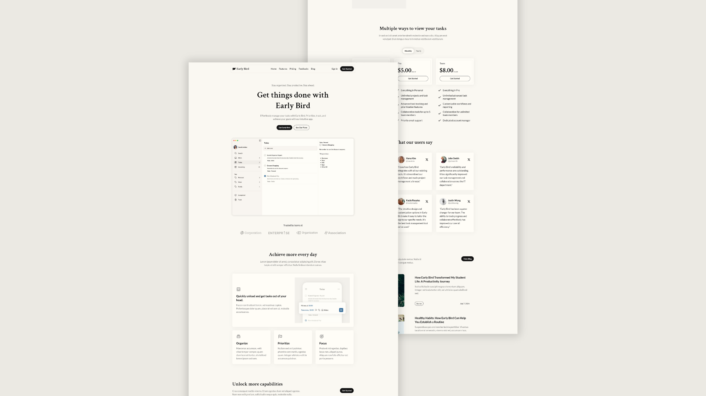

## 🔥 Responsive SAAS Website

* Uses fonts from Google's Web Font collection.
* Resize items anywhere within the grid to produce powerful, responsive layouts.
* Reusable elements you can use across your site.
* Build your lead lists and subscriber base with beautiful forms.
* Site navigation automatically collapses into a mobile-friendly menu on smaller devices.
* Displays perfectly on desktops, tablets, and phones.

 ❤️ Follow my [Creahsion](https://x.com/CreashionCode/) account on X!